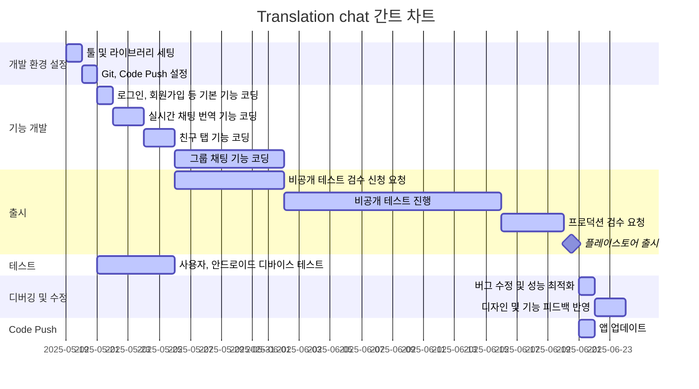

# 목차
- [목차](#목차)
- [앱 서비스 프로젝트 계획서](#앱-서비스-프로젝트-계획서)
  - [프로젝트 개요](#프로젝트-개요)
    - [프로젝트 명](#프로젝트-명)
    - [기획 배경](#기획-배경)
    - [목표](#목표)
  - [시장 분석](#시장-분석)
    - [타겟 사용자](#타겟-사용자)
  - [요구사항 정의](#요구사항-정의)
    - [기능적 요구사항](#기능적-요구사항)
    - [비기능적 요구사항](#비기능적-요구사항)
  - [서비스](#서비스)
    - [핵심 기능](#핵심-기능)
    - [서비스 흐름도](#서비스-흐름도)
  - [기술 스택](#기술-스택)
    - [개발환경](#개발환경)
    - [프론트엔드](#프론트엔드)
    - [백엔드 / 서버리스](#백엔드--서버리스)
  - [개발 일정](#개발-일정)

# 앱 서비스 프로젝트 계획서
## 프로젝트 개요
### 프로젝트 명
Translation chat (실시간 번역 채팅 앱)

### 기획 배경
- 해외 친구와의 간편한 소통 니즈 증가

- 기존 번역 앱과 메시징 앱을 오가며 대화하는 번거로움

- 언어 교환 및 외국어 학습을 원하는 유저층의 실용적 번역 도구 필요

### 목표
- 사용자가 자신의 모국어로 메시지를 작성하면 실시간으로 상대방의 언어로 번역되어 전달되는 채팅 플랫폼 구축

- 텍스트 메시지뿐만 아니라 음성 메시지의 실시간 번역 기능 제공

- 개인 대화, 그룹 채팅, 커뮤니티 채널 등 다양한 소통 형태 지원( Discord, Slack )

## 시장 분석
### 타겟 사용자
- 국제 교류 학생 및 교육자 (15-35세)

- 다국적 팀 / 프로젝트 참여자 ( 20 ~ 45세 )

- 여행자 및 해외 거주자 (18-65세)

## 요구사항 정의
<!-- 📝 🔧 🆕 🔁 🔄-->
🆕 **v1.0** – 초안 작성 *( 2025-05-19 )*
### 기능적 요구사항
| 순서 | 요구항목 대분류 | 요구항목 소분류    | 요구내용                                                | 기술 요구사항                          | 검토 의견      | 우선순위 | 수정여부   |
| :--- | :-------------- | :----------------- | :------------------------------------------------------ | :------------------------------------- | :------------- | :------- | :--------- |
| 1    | 회원인증        | 로그인             | 이메일/비밀번호를 통한 로그인 가능                      | Firebase Authentication 연동필요       | 필수           | 1        | 2025-05-19 |
| 2    | 회원인증        | 회원가입           | 이메일/비밀번호를 통한 회원가입 기능                    | Firebase Authentication 연동필요       | 필수           | 1        | 2025-05-19 |
| 3    | 사용자 설정     | 언어 설정          | 최초 로그인 시 모국어 선택, 이후 설정에서 변경 가능     | -                                      | 필수           | 1        | 2025-05-19 |
| 4    | 채팅            | 개인 채팅          | 친구 선택 후 1:1 채팅방 개설 기능                       | Firebase Cloud Firestore 연동 필요     | 필수           | 1        | 2025-05-19 |
| 5    | 채팅            | 그룹 채팅          | 여러 사용자 선택 후 그룹 채팅방 개설 기능               | Firebase Cloud Firestore 연동 필요     | 기술 검토 필요 | 2        | 2025-05-19 |
| 6    | 메시지          | 텍스트 메시지 번역 | 상대방에 받은 텍스트 메시지를 자신의 모국어에 맞게 번역 | 번역 API 연동 확인 필요                | 필수           | 1        | 2025-05-19 |
| 7    | 메시지          | 음성 메시지 입력   | 사용자 음성녹음 -> 텍스트 변환 -> 전송                  | Flutter speech_to_text 라이브러리 사용 | 필수           | 1        | 2025-05-19 |
| 8    | 알림            | 푸시 알림          | 새 메시지 수신 시 알림                                  | Firebase Messaging 연동필요            | 권장           | 2        | 2025-05-19 |
| 9    | 친구 관리       | 친구 추가/삭제     | 이메일 기반 친구 추가/삭제 기능                         | Firebase Cloud Firestore 연동 필요     | 권장           | 2        | 2025-05-19 |

### 비기능적 요구사항
| 순서 | 요구항목 대분류 | 요구항목 소분류  | 요구내용                 | 기술 요구사항                 | 검토 의견 | 우선순위 | 수정여부   |
| :--- | :-------------- | :--------------- | :----------------------- | :---------------------------- | :-------- | :------- | :--------- |
| 1    | 접근 권한       | 채팅방 접근 제한 | 참여자 외 접근 차단 필요 | Firestore 보안 규칙 설정 필요 | 필수      | 1        | 2025-05-19 |

## 서비스
### 핵심 기능
- 실시간 채팅 번역

- 음성 메시지 번역

- 대화 유형 다양화

### 서비스 흐름도
- 최초 사용자 경험
  - 앱 다운로드 → 회원가입/로그인 → 모국어 설정 → 홈 화면

- 개인 채팅 시작
  - 홈 화면 → 친구 선택 → 상대방 언어 자동 감지/설정 → 채팅 시작 → 실시간 번역 대화

- 그룹 채팅 시작
  - 홈 화면 -> 그룹 선택 -> 상대방 언어 자동 감지/설정 -> 채팅 시작 -> 실시간 번역 대화

- 텍스트 / 음성 메시지 번역
  - 채팅 화면 → 마이크 버튼 터치 → 음성 메시지 녹음 → 전송 → 상대방에게 텍스트+음성 번역본 전달

## 기술 스택
### 개발환경
Visual Studio Code

### 프론트엔드
Flutter
- firebase_core
- firebase_auth
- cloud_firestore
- firebase_messaging

### 백엔드 / 서버리스
Firebase
- Authentication
- Cloud Firestore

## 개발 일정
<!-- 📝 🔧 🆕 🔁 🔄-->
- 🆕 **v1.0** – 초안 작성 *( 2025-05-16 )*

