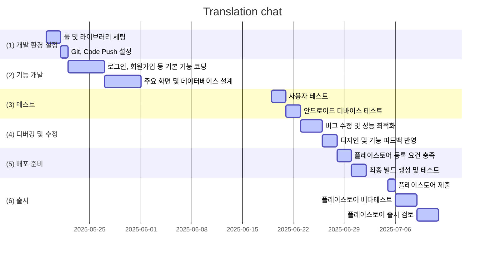

# 목차
- [목차](#목차)
- [앱 서비스 프로젝트 계획서](#앱-서비스-프로젝트-계획서)
  - [프로젝트 개요](#프로젝트-개요)
    - [프로젝트 명](#프로젝트-명)
    - [기획 배경](#기획-배경)
    - [목표](#목표)
  - [시장 분석](#시장-분석)
    - [타겟 사용자](#타겟-사용자)
  - [서비스](#서비스)
    - [핵심 기능](#핵심-기능)
    - [서비스 흐름도](#서비스-흐름도)
  - [기술 스택](#기술-스택)
    - [개발환경](#개발환경)
    - [프론트엔드](#프론트엔드)
    - [백엔드 / 서버리스](#백엔드--서버리스)
  - [개발 일정](#개발-일정)

# 앱 서비스 프로젝트 계획서
## 프로젝트 개요
### 프로젝트 명
Translation chat (실시간 번역 채팅 앱)

### 기획 배경
- 해외 친구와의 간편한 소통 니즈 증가

- 기존 번역 앱과 메시징 앱을 오가며 대화하는 번거로움

- 언어 교환 및 외국어 학습을 원하는 유저층의 실용적 번역 도구 필요

### 목표
- 사용자가 자신의 모국어로 메시지를 작성하면 실시간으로 상대방의 언어로 번역되어 전달되는 채팅 플랫폼 구축

- 텍스트 메시지뿐만 아니라 음성 메시지의 실시간 번역 기능 제공

- 개인 대화, 그룹 채팅, 커뮤니티 채널 등 다양한 소통 형태 지원( Discord, Slack )

## 시장 분석
### 타겟 사용자
- 국제 교류 학생 및 교육자 (15-35세)

- 다국적 팀 / 프로젝트 참여자 ( 20 ~ 45세 )

- 여행자 및 해외 거주자 (18-65세)

## 서비스
### 핵심 기능
- 실시간 채팅 번역

- 음성 메시지 번역

- 대화 유형 다양화

### 서비스 흐름도
- 최초 사용자 경험
  - 앱 다운로드 → 회원가입/로그인 → 모국어 설정 → 홈 화면

- 개인 채팅 시작
  - 홈 화면 → 친구 선택 → 상대방 언어 자동 감지/설정 → 채팅 시작 → 실시간 번역 대화

- 그룹 채팅 시작
  - 홈 화면 -> 그룹 선택 -> 상대방 언어 자동 감지/설정 -> 채팅 시작 -> 실시간 번역 대화

- 텍스트 / 음성 메시지 번역
  - 채팅 화면 → 마이크 버튼 터치 → 음성 메시지 녹음 → 전송 → 상대방에게 텍스트+음성 번역본 전달

## 기술 스택
### 개발환경
Visual Studio Code

### 프론트엔드
Flutter
- firebase_core
- firebase_auth
- cloud_firestore
- firebase_messaging

### 백엔드 / 서버리스
Firebase
- Authentication
- Cloud Firestore

## 개발 일정

<!-- 📝 🔧 🆕 🔁 🔄-->
- 🆕 **v1.0** – 프로토타입 작성 *( 2025-05-16 )*
